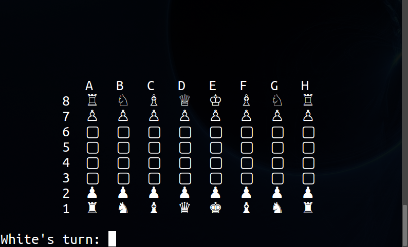
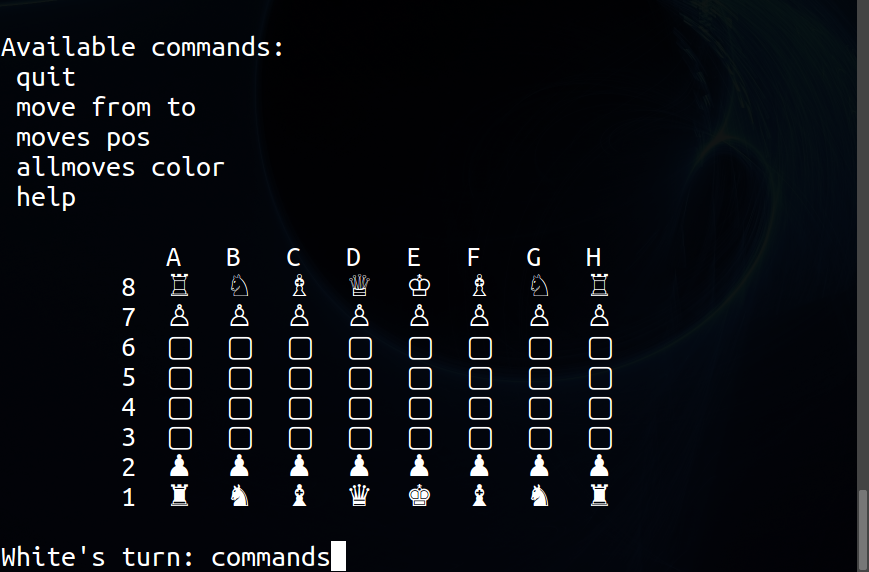
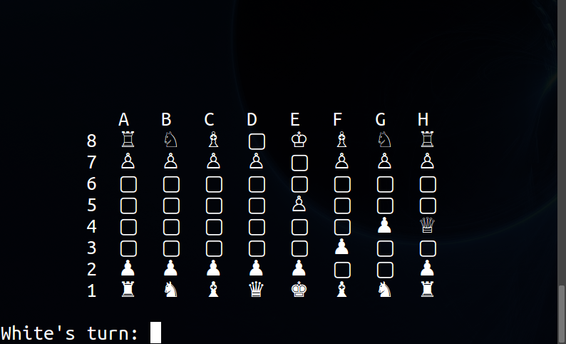

# Simplest Chess


##### Run:

Install the [Haskell Platform](https://www.haskell.org/platform/)  and clone the repo. Then run:

```
ghci
:l Engine.hs
main
```

##### Screenshots:

Clean board:  


Available commands:  


A game:  

